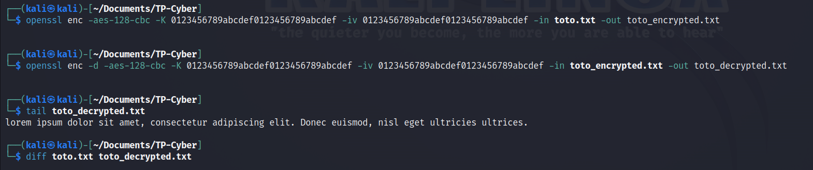
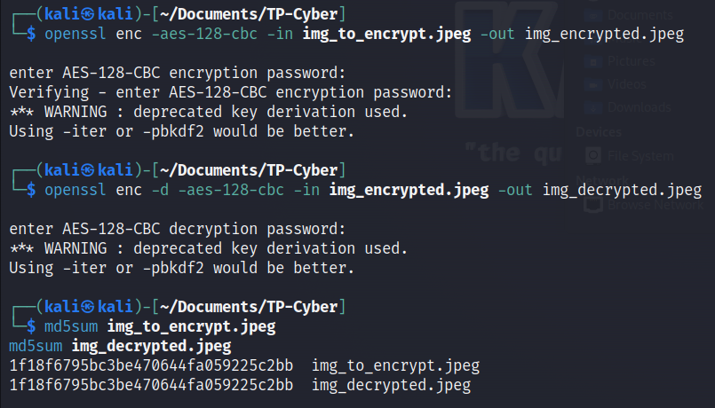
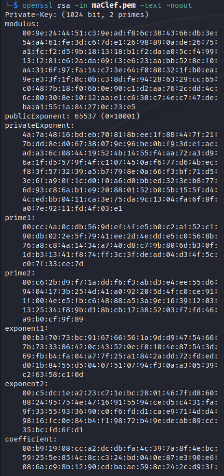
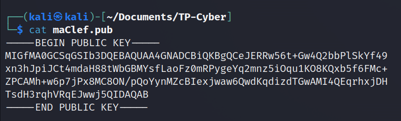
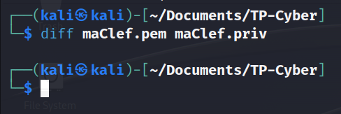
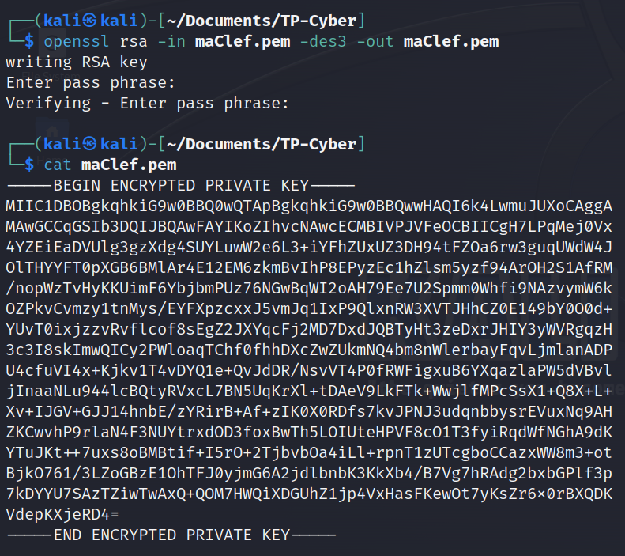
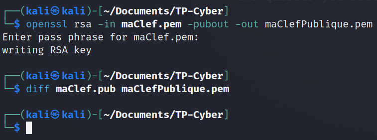
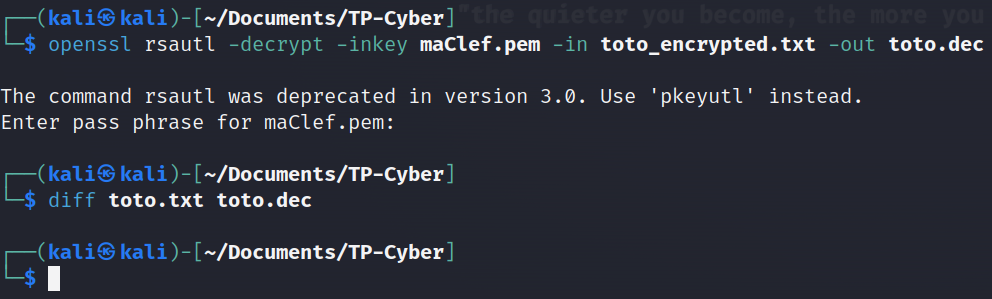
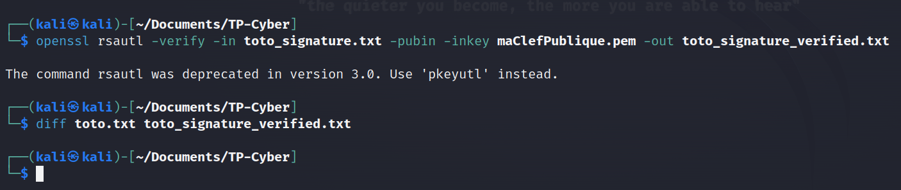

# Cybersécurité - TP 1
## GIBOZ Alexandre, MAURICE Romain
## INFO1 2022-2025
***

## Exercice 1 - Empreintes numériques (en anglais, digest ou hash)

1. **En utilisant la commande openssl list -digest-algorithms ou openssl list -digest-commands, déterminer les primitives de hachage supportées.**

Les primitives de hachage supportées sont les suivantes :
```
RSA-MD4 => MD4
RSA-MD5 => MD5
RSA-RIPEMD160 => RIPEMD160
RSA-SHA1 => SHA1
RSA-SHA1-2 => RSA-SHA1
RSA-SHA224 => SHA224
RSA-SHA256 => SHA256
RSA-SHA3-224 => SHA3-224
RSA-SHA3-256 => SHA3-256
RSA-SHA3-384 => SHA3-384
RSA-SHA3-512 => SHA3-512
RSA-SHA384 => SHA384
RSA-SHA512 => SHA512
RSA-SHA512/224 => SHA512-224
RSA-SHA512/256 => SHA512-256
RSA-SM3 => SM3
BLAKE2b512
BLAKE2s256
id-rsassa-pkcs1-v1_5-with-sha3-224 => SHA3-224
id-rsassa-pkcs1-v1_5-with-sha3-256 => SHA3-256
id-rsassa-pkcs1-v1_5-with-sha3-384 => SHA3-384
id-rsassa-pkcs1-v1_5-with-sha3-512 => SHA3-512
MD4
md4WithRSAEncryption => MD4
MD5
MD5-SHA1
md5WithRSAEncryption => MD5
ripemd => RIPEMD160
RIPEMD160
ripemd160WithRSA => RIPEMD160
rmd160 => RIPEMD160
SHA1
sha1WithRSAEncryption => SHA1
SHA224
sha224WithRSAEncryption => SHA224
SHA256
sha256WithRSAEncryption => SHA256
SHA3-224
SHA3-256
SHA3-384
SHA3-512
SHA384
sha384WithRSAEncryption => SHA384
SHA512
SHA512-224
sha512-224WithRSAEncryption => SHA512-224
SHA512-256
sha512-256WithRSAEncryption => SHA512-256
sha512WithRSAEncryption => SHA512
SHAKE128
SHAKE256
SM3
sm3WithRSAEncryption => SM3
ssl3-md5 => MD5
ssl3-sha1 => SHA1
whirlpool
```

2. **Créer un Fichier texte contenant un petit paragraphe (toto.txt), et donner les empreintes numériques obtenues avec les primitives : md5, sha1, sha256, sha512. 
    La commande à utiliser est : 
    openssl dgst -<fonction de hachage> -out <Fichier qui va stocker l'empreinte> <Fichier à hasher>.**

On créer un fichier contenant un petit paragraphe :
```shell
echo "Lorem ipsum dolor sit amet, consectetur adipiscing elit. Donec euismod, nisl eget ultricies ultrices." > toto.txt
```

On récupère les empreintes numériques :
```shell
openssl dgst -md5 -out toto_md5.txt toto.txt
openssl dgst -sha1 -out toto_sha1.txt toto.txt
openssl dgst -sha256 -out toto_sha256.txt toto.txt
openssl dgst -sha512 -out toto_sha512.txt toto.txt
```

Les résultats sont les suivants (dans l'ordre) :
```shell
MD5(toto.txt)= 32bcb585dd3d0bb3ac979d09ecb5a0c9
SHA1(toto.txt)= 12fe55b03216d59a362c0c961a2d4b75f830a2bb
SHA2-256(toto.txt)= 89623168d1165956b148d5ec9cd39cad5e022b109d5fa5472b9a6e04bab5301d
SHA2-512(toto.txt)= 28d4a43d704c51a179dc19db1f0eded9198e57154aba86687ec728b8787fd72c9ee774d72793990c61a49319687b96be6c598e2ac6d7ac0d073150e81dce9514
```

3. **Donner la taille de chaque empreinte (en bits).**

Les tailles des empreintes sont les suivantes :
```shell
MD5(toto.txt)= 128 bits
SHA1(toto.txt)= 160 bits
SHA2-256(toto.txt)= 256 bits
SHA2-512(toto.txt)= 512 bits
```

4. **Modifier un caractère dans le Fichier texte, et calculer à nouveau les empreintes numériques. 
    Que constatez-vous ? Quelle conclusion ?**

On modifie le fichier :
```shell
sed -i 's/L/l/' toto.txt
```

Les nouvelles empreintes numériques sont les suivantes :
```shell
MD5(toto.txt)= 7867f7eb0bf3d4dc827f210588855786
SHA1(toto.txt)= 3da409e50ff4cca900ba595a9eca1ec1e833542a
SHA2-256(toto.txt)= 1db41cb459acfd9df9a7353a7a114c96fa801f6d55ffd78801c4642d7ddc32ce
SHA2-512(toto.txt)= c3c4ddc71fdc823016c72f93467076199868d0903115227a2b0a8ba2da993f6f14a483f9dad863638ac3d8e9c7c3f9e5b223fc884c5b64a53b9087e7feffcb00
```

On constate que les empreintes numériques sont totalement différentes, alors que le fichier n'a été modifié que d'un seul caractère.

Cela démontre tout l'intérêt du hashage. A condition d'utiliser un algorithme sécurisé et robuste (sans collisions aucune), il permet de vérifier l'intégrité de fichiers.
Ce contrôle d'intégrité est très utilisé, que ça soit pour du téléchargement ou des bases de données de hash d'antivirus.

Le hashage est supposé être unilatéral, c'est à dire qu'il est impossible de retrouver le fichier d'origine à partir de son empreinte numérique. 
Cependant, cela peut être déjoué avec des dictionnaires/rainbow tables.
Dans le cadre de crack de mots de passe (ou l'on possède un hash d'un mot de passe à trouver en clair), on hash chaque mot de passe dans un dictionnaire avec le même algorithme. Si les deux hash sont identiques, alors on a trouvé le mot de passe.

5. **L'éditeur peut mettre à disposition une empreinte numérique comme une sorte de checksum pour vous
   permettre de vérifier l'intégrité d'un Fichier téléchargé (le Fichier téléchargé est bien celui attendu et
   qu'il n'ait pas été altéré en cours de route)**
a) **Télécharger un petit Fichier (non volumineux) et son empreintes SHA256 en utilisant par exemple
   le lien : https://archive.apache.org/dist/openofice/4.1.3/binaries/SDK/**

Le lien ne fonctionne plus, je vais donc télécharger le gestionnaire de dépendance "Composer" à l'adresse suivante:
"https://getcomposer.org/download/"

On télécharge le fichier et son empreinte SHA256 :
```shell
wget https://getcomposer.org/download/latest-stable/composer.phar
wget https://getcomposer.org/download/latest-stable/composer.phar.sha256
```

b) **Comparer l'empreinte de l'éditeur à celle calculée par openSSL.**

L'empreinte dans le fichier "composer.phar.sha256" est la suivante :
```shell
9256c4c1c803b9d0cb7a66a1ab6c737e48c43cc6df7b8ec9ec2497a724bf44de
```

On calcule l'empreinte SHA256 du fichier "composer.phar" téléchargé :
```shell
openssl dgst -sha256 composer.phar
```

On obtient le résultat suivant :
```shell
SHA2-256(composer.phar)= 9256c4c1c803b9d0cb7a66a1ab6c737e48c43cc6df7b8ec9ec2497a724bf44de
```

c) **Quelle conclusion ?**

Les hash sont les même. On peut donc en déduire que le fichier téléchargé est bien le bon.

Comme mentionné précédemment, le hashage est très utile pour vérifier l'intégrité d'un fichier téléchargé.

<br>

## Exercice 2 - Chiffrement symétrique

1. **En utilisant la commande openssl list -cipher-commands, déterminer les algorithmes de chiffrement et
   les modes associés supportés par openssl.**

Les algorithmes de chiffrement et les modes associés supportés par openssl sont les suivants :
```shell
aes-128-cbc       aes-128-ecb       aes-192-cbc       aes-192-ecb       
aes-256-cbc       aes-256-ecb       aria-128-cbc      aria-128-cfb      
aria-128-cfb1     aria-128-cfb8     aria-128-ctr      aria-128-ecb      
aria-128-ofb      aria-192-cbc      aria-192-cfb      aria-192-cfb1     
aria-192-cfb8     aria-192-ctr      aria-192-ecb      aria-192-ofb      
aria-256-cbc      aria-256-cfb      aria-256-cfb1     aria-256-cfb8     
aria-256-ctr      aria-256-ecb      aria-256-ofb      bf                
bf-cbc            bf-cfb            bf-ecb            bf-ofb            
camellia-128-cbc  camellia-128-ecb  camellia-192-cbc  camellia-192-ecb  
camellia-256-cbc  camellia-256-ecb  cast              cast-cbc          
cast5-cbc         cast5-cfb         cast5-ecb         cast5-ofb         
des               des-cbc           des-cfb           des-ecb           
des-ede           des-ede-cbc       des-ede-cfb       des-ede-ofb       
des-ede3          des-ede3-cbc      des-ede3-cfb      des-ede3-ofb      
des-ofb           des3              desx              rc2               
rc2-40-cbc        rc2-64-cbc        rc2-cbc           rc2-cfb           
rc2-ecb           rc2-ofb           rc4               rc4-40            
seed              seed-cbc          seed-cfb          seed-ecb          
seed-ofb          sm4-cbc           sm4-cfb           sm4-ctr           
sm4-ecb           sm4-ofb
```

2. **Classer ces algorithmes en algorithmes par bloc et par flot**

Les algorithmes par bloc sont les suivants :
```shell
AES (Advanced Encryption Standard)
DES (Data Encryption Standard)
3DES (Triple Data Encryption Standard)
Camellia
IDEA (International Data Encryption Algorithm)
CAST5 (CAST-128)
SEED (KISA SEED)
BF (Blowfish)
RC2 (Rivest Cipher 2)
RC4 (Rivest Cipher 4)
RC5 (Rivest Cipher 5)
```

Les algorithmes par flot sont les suivants :
```shell
ChaCha20
Salsa20
```

3. **Les chiffrement symétrique a besoin d'une clef partagée. Cette clef peut être générée par un mot de
   passe ou donnée de manière explicite.**
a) **Chiffrer le Fichier créé précédemment (toto.txt) en toto.txt.enc en utilisant l'algorithme AES avec
   une taille de clef de 128bits générée par mot de passe et le mode CBC. La commande à utiliser
   est : openssl enc -aes.... -p. L'option -p à la finn permet d'afficher plus de détails.**

On chiffre le fichier "toto.txt" :
```shell
openssl enc -aes-128-cbc -in toto.txt -out toto.txt.enc -p
```

On obtient par la suite un scanner qui nous demande de spécifier un mot de passe. On entre le mot de passe "away".

Les données suivantes nous sont retournées:
```shell
salt=BD22A34116F41C82
key=2F39440CE407BA1C68F0FD3848A58EFB
iv =3267F3CA7752ABD5AA9260E8AAC01911
```

b) **Qu'est ce que le salt ? expliquer son rôle ? comment il est généré ? comment il est stocké ?**

Le salt est une suite de caractères aléatoires qui est ajoutée au mot de passe avant le hashage. Il ajoute de l'entropie au mot de passe.

Il permet d'éviter les attaques par dictionnaire et par force brute.

Il est généré de manière aléatoire par le programme (openssl).

Il est, en général, stocké en association avec les données hachées ou dérivées.

Dans notre cas, le salt est `BD22A34116F41C82`.

c) **Quelles sont la clef, l'IV et leurs tailles générées automatiquement par le mot de passe ?**

La clef est `2F39440CE407BA1C68F0FD3848A58EFB` et le vecteur d'initialisation est `3267F3CA7752ABD5AA9260E8AAC01911`.

Leurs tailles respectives sont de 128 bits (AES).

d) **Déchiffrer le fichier toto.txt.enc en toto.dec en utilisant les trois méthodes : via le mot de passe
    à taper suite à la commande, en précisant le salt et le mot de passe comme argument, ou en
    précisant l'IV et la clef comme argument. 
    La commande à utiliser est : openssl enc -d -aes ....**

On déchiffre le fichier "toto.txt.enc" en utilisant le mot de passe :
```shell
openssl enc -d -aes-128-cbc -in toto.txt.enc -out toto.dec -p
```

On déchiffre le fichier "toto.txt.enc" en utilisant le salt et le mot de passe :
```shell
openssl enc -d -aes-128-cbc -in toto.txt.enc -out toto.dec -p -S BD22A34116F41C82
```

On déchiffre le fichier "toto.txt.enc" en utilisant l'IV et la clef :
```shell
openssl enc -d -aes-128-cbc -in toto.txt.enc -out toto.dec -p -K 2F39440CE407BA1C68F0FD3848A58EFB -iv 3267F3CA7752ABD5AA9260E8AAC01911
```

e) **Comparer les deux fichiers toto.txt et toto.dec avec la commande : diff toto.txt toto.dec. Quelle
    conclusion ?**

On compare les fichiers "toto.txt" et "toto.dec" :
```shell
diff toto.txt toto.dec
```

La commande ne retourne rien, ce qui signifie que les deux fichiers sont identiques.

On peut en conclure que le chiffrement et le déchiffrement ont bien fonctionné, et que l'intégrité à été préservée, car le fichier avant et après chiffrement sont identiques.

f) **Tenter de déchiffrer le fichier toto.enc en utilisant un mauvais mot de passe. 
    Comment réagit openSSL?**

On déchiffre le fichier "toto.txt.enc" en utilisant le mot de passe "esipe" (mauvais mot de passe) :
```shell
openssl enc -d -aes-128-cbc -in toto.txt.enc -out toto.dec -p
```

Le résultat suivant est retourné par la commande :
```shell
salt=BD22A34116F41C82
key=12DAE481E21A39BDE09AD65227772202
iv =023A3F861C061C67DDBD3F130AF5B1F8
bad decrypt
4057CFD4577F0000:error:1C800064:Provider routines:ossl_cipher_unpadblock:bad decrypt:../providers/implementations/ciphers/ciphercommon_block.c:124:
```

Si l'on ouvre le fichier "toto.dec", on constate que le fichier est rempli de caractères aléatoires:
```shell
��N卼�O��%ԅy⇯t�>i;x/<��j�W8y&,���kX���h�f 
```

g) **Effectuer le chiffrement et le déchiffrement du fichier toto.txt en utilisant une clef explicite de
    128 bits exprimée par 32 chiffres hexa et un vecteur d'initialisation de 128 bits exprimé par 32
    chiffres hexa.**

On chiffre le fichier "toto.txt" :
```shell
openssl enc -aes-128-cbc -K 0123456789abcdef0123456789abcdef -iv 0123456789abcdef0123456789abcdef -in toto.txt -out toto_encrypted.txt
```

On déchiffre le fichier "toto_encrypted.txt" :
```shell
openssl enc -d -aes-128-cbc -K 0123456789abcdef0123456789abcdef -iv 0123456789abcdef0123456789abcdef -in toto_encrypted.txt -out toto_decrypted.txt
```

On compare le contenu de "toto.txt" et "toto_decrypted.txt" :
```shell
diff toto.txt toto_decrypted.txt
```



La commande ne retourne rien, ce qui signifie que les deux fichiers sont identiques.

h) **Tester le chiffrement et le déchiffrement d'une image**

On chiffre l'image suivante. Le mot de passe est "away":


```shell
openssl enc -aes-128-cbc -in img_to_encrypt.jpeg -out img_encrypted.jpeg
```

On déchiffre l'image:
```shell
openssl enc -d -aes-128-cbc -in img_encrypted.jpeg -out img_decrypted.jpeg
```

On compare les hash des deux images:
```shell
md5sum img_to_encrypt.jpeg
md5sum img_decrypted.jpeg
```

Les hash sont identiques, ce qui signifie que l'intégrité de l'image est préservée.



<br>

## Exercice 3 : Chiffrement asymétrique RSA

1. **Générer une clef privée de module de taille 1024 bits avec la commande : openssl genrsa -out maClef.pem
   1024, et visualiser le contenu du fichier ainsi généré (cat maClef.pem).**

On génère une clef privée de module de taille 1024 bits :
```shell
openssl genrsa -out maClef.pem 1024
```

2. **Afficher les paramètres de la clef privée RSA avec la commande openssl rsa -in maClef.pem -text -noout,
   et commenter le résultat.**

On affiche les paramètres de la clef privée RSA :



La première ligne indique que la taille de la clef est de 1024 bits.
"2 primes" indique qu'il y a deux facteurs premiers dans la clef.

Les différents modules sont affichés, représentant des valeurs dérivées des nombres premiers.

3. **Déterminer la clef publique, la clef privée et les deux nombres premiers.**

On détermine la clef publique avec la commande suivante :
```shell
openssl rsa -in maClef.pem -pubout -out maClef.pub
```

On obtient un fichier "maClef.pub" contenant la clef publique:



La commande suivante permet d'obtenir la clef privée. Cependant, le fichier "maClef.pem" contient déjà la clef privée.
```shell
openssl rsa -in maClef.pem -out maClef.priv
```



Les deux nombres premiers sont affichés dans le fichier "maClef.pem" :
```shell
openssl rsa -in maClef.pem -text -noout | awk '/prime1:/{getline; print} /prime2:/{getline; print}'
```

On obtient les valeurs suivantes:
```
00:cc:4a:0c:db:56:9d:ef:4f:e5:b0:c2:a1:52:c1: (= 217478085165881973593960816363007611137)
00:c6:2b:d9:f7:1a:dd:f6:f3:ab:d3:e4:ee:55:d6: (= 215216864580500029508825281394181271990)
```

4. **Il n'est pas prudent de stocker la clef privée en clair. Pour chiffrer le fichier maClef.pem, 3 algorithmes
   de chiffrement symétrique sont possibles : des, des3 et idea.**
a) **Chiffrer le fichier maClef.pem avec la commande openssl rsa -in maClef.pem -des3 -out maClef.pem, et visualiser et commenter son impact.**

Une fois la commande entrée, un scanner est ouvert afin de demander un mot de passe. On choisit le mot de passe "away".

Le nouveau fichier "maClef.pem" est chiffré (différent de son contenu précédent):



5. **Générer la clef publique RSA à partir de la clef privée avec la commande openssl rsa -in maClef.pem
   -pubout -out maClefPublique.pem, et commenter le contenu du fichier ainsi généré.**

Une fois le mot de passe entré, on obtient la même clef publique qu'auparavant:



6. **Pour chiffrer avec une clef publique RSA, on utilise la commande : openssl rsautl -encrypt -pubin -inkey
    maClefPublique.pem -in <fichier clair> -out <fichier chiffré>. 
    Pour déchiffrer, l'option -decrypt est utilisée.**
a) **Effectuer le chiffrement et le déchiffrement du fichier toto.txt.**

On chiffre le fichier "toto.txt" avec la commande suivante :
```shell
openssl rsautl -encrypt -pubin -inkey maClefPublique.pem -in toto.txt -out toto_encrypted.txt
```

On déchiffre le fichier "toto_encrypted.txt" avec la commande suivante :
```shell
openssl rsautl -decrypt -inkey maClef.pem -in toto_encrypted.txt -out toto.dec
```

b) **Comparer les deux fichiers toto.txt et toto.dec.**

Les fichiers sont identiques. On a bien conservé l'intégrité de toto.txt:



c) **Avec la clef publique d'un autre groupe, chiffrer votre fichier toto.txt et envoyer le résultat à ce
    groupe pour le déchiffrer. 
    Commenter le résultat.**

TODO

<br>

## Exercice 4 : Signatures numériques

1. **En utilisant la commande openssl rsautl -sign -in <fichier où l'empreinte est stockée> -inkey <fichier
   de la clef privé> -out <fichier qui va stocker la signature>, générer la signature du fichier toto.txt.**

On génère la signature du fichier "toto.txt" avec la commande suivante :
```shell
openssl rsautl -sign -in toto.txt -inkey maClef.pem -out toto_signature.txt
```

2. **En utilisant la commande penssl rsautl -verify -in <fichier où la signature est stockée> -pubin -inkey
   <fichier de la clef publique> -out <fichier où l'empreinte est stockée>, vérifier la signature du fichier
   toto.txt.**

On vérifie la signature du fichier "toto.txt" avec la commande suivante :
```shell
openssl rsautl -verify -in toto_signature.txt -pubin -inkey maClefPublique.pem -out toto_signature_verified.txt
```

On récupère bien le contenu du fichier "toto.txt" à l'identique:



<br>

## Exercice 5 : Certificats - Projet

Dans ce projet, vous allez générer un fake serveur d'amazon sécurisé. Un fake certificat est nécessaire
pour le fakes erveur. Ce fake certificat sera signé par un fake CA.

1. **Réaliser un fake serveur d'amazon en suivant les étapes indiquées dans le fichier fakeServeurSSL-TLS**
