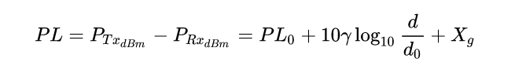
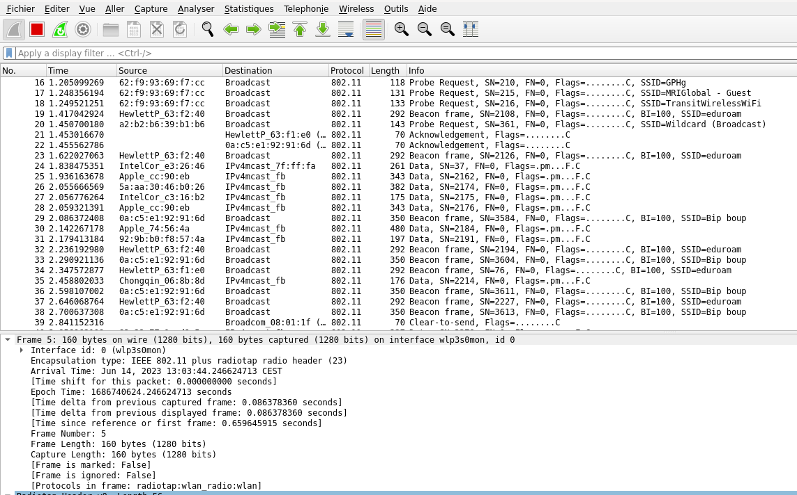

# Wi-fi - TP
## GIBOZ Alexandre, MAURICE Romain
## INFO1 2022-2025
***

## Exercice 1 - Éléments de base

1. **Déterminer le type de périphérique WiFi (chipset) de votre équipement ("lspi" pour les carte pci,
   "lsub" pour les dongle USB, dans les paramètres réseaux avec windows, ..)**

On entre la commande suivante pour obtenir les informations sur les cartes réseaux:
```bash
sudo iwconfig
```

Le nom de la carte est `wlp3s0`.

2. **Est-ce un périphérique mono-band ou bi-band ?**

Dans notre cas, le périphérique est tri-band.
Etant donné qu'en Europe, la fréquence 4 Ghz est innutilisable, elle ne peut utiliser que deux bandes.
Elle est donc, au final, bi-band.

3. **Quel est le nom de son driver ? ("ethtool -i" sous Linux, "netsh wlan show ..." sous windows, ...)**

On entre la commande suivante pour obtenir les informations sur le driver:
```
sudo ethtool -i wlp3s0
```

Le nom du driver est `iwlwifi`.

4. **Le WiFi proposes plusieurs standards : WiFi 1 (IEEE 802.11a), WiFi 2 (IEEE 802.11b), WiFi 3 (IEEE
   802.11g), WiFi 4 (IEEE 802.11n), WiFi 5 (IEEE 802.11ac), WiFi 6 (IEEE 802.11ax), WiFi 7 (IEEE
   802.11be)**

(a). **Quelles sont les bandes de fréquences supportées par chaque standard ?**

Wi-Fi 7 	802.11be    2.4/5/6
Wi-Fi 6E 	802.11ax    6
Wi-Fi 6 	802.11ax    2.4/5
Wi-Fi 5 	802.11ac    5
Wi-Fi 4 	802.11n     2.4/5
Wi-Fi 3 	802.11g     2.4/5
Wi-Fi 2 	802.11b     2.4
Wi-Fi 1 	802.11      2.4

b). **Quels sont les standards proposés par votre périphérique WiFi ainsi que leurs débits théoriques max ?**

Les standards proposés sont le Wi-FI 6E (802.11ax).
Le débit théorique max est de 10.5 Gbit/s.

5. **Combien de canaux WiFi existent dans la bande de fréquences 2.4Ghz ? déterminer les numéros assignés**

On utilise la commande suivante pour déterminer les canaux WiFi de la carte:
```bash
sudo iwlist wlp3s0 channel
```

```
Channel 01 : 2.412 GHz
Channel 02 : 2.417 GHz
Channel 03 : 2.422 GHz
Channel 04 : 2.427 GHz
Channel 05 : 2.432 GHz
Channel 06 : 2.437 GHz
Channel 07 : 2.442 GHz
Channel 08 : 2.447 GHz
Channel 09 : 2.452 GHz
Channel 10 : 2.457 GHz
Channel 11 : 2.462 GHz
Channel 12 : 2.467 GHz
Channel 13 : 2.472 GHz
```

6. **Combien de canaux WiFi existent dans la bande de fréquences 5Ghz ? déterminer les numéros assignés.**

```
Channel 36 : 5.18 GHz
Channel 40 : 5.2 GHz
Channel 44 : 5.22 GHz
Channel 48 : 5.24 GHz
Channel 52 : 5.26 GHz
Channel 56 : 5.28 GHz
Channel 60 : 5.3 GHz
Channel 64 : 5.32 GHz
Channel 68 : 5.34 GHz
Channel 72 : 5.36 GHz
Channel 76 : 5.38 GHz
Channel 80 : 5.4 GHz
Channel 84 : 5.42 GHz
Channel 88 : 5.44 GHz
Channel 92 : 5.46 GHz
Channel 96 : 5.48 GHz
Channel 100 : 5.5 GHz
Channel 104 : 5.52 GHz
```

<br>

## Exercice 2 - Le Sniffing WiFI

1. **Scanner la liste des réseaux WiFi détectés par votre équipement ("iwlist" sous linux, "netsh wlan show
   all" sous windows, "l'application WiFi Analyze open-source sous Android") :**

a) **Afficher le détail d'un ou deux réseaux Wifi**

On entre les commandes suivantes afin de pouvoir effectuer un scan:
```bash
sudo rfkill unblock wifi
sudo ip link set dev wlp3s0 up
sudo iw dev wlp3s0 scan
```

On obtient de nombreux résultats, en voici deux exemples:
```
BSS 34:fc:b9:63:f2:50(on wlp3s0)
    last seen: 6400.505s [boottime]
    TSF: 75379223000 usec (0d, 20:56:19)
    freq: 5320
    beacon interval: 100 TUs
    capability: ESS Privacy SpectrumMgmt (0x0111)
    signal: -89.00 dBm
    last seen: 6532 ms ago
    Information elements from Probe Response frame:
    SSID: eduroam
    Supported rates: 6.0* 9.0 12.0* 18.0 24.0* 36.0 48.0 54.0
    DS Parameter set: channel 64
    Country: FR    Environment: Indoor/Outdoor
        Channels [36 - 64] @ 23 dBm
        Channels [100 - 140] @ 30 dBm
        Channels [149 - 165] @ 14 dBm
    Power constraint: 0 dB
    TPC report: TX power: 18 dBm
    RSN:     * Version: 1
         * Group cipher: CCMP
         * Pairwise ciphers: CCMP
         * Authentication suites: IEEE 802.1X
         * Capabilities: 4-PTKSA-RC 4-GTKSA-RC (0x0028)
    HT capabilities:
        Capabilities: 0x1ef
            RX LDPC
            HT20/HT40
            SM Power Save disabled
            RX HT20 SGI
            RX HT40 SGI
            TX STBC
            RX STBC 1-stream
            Max AMSDU length: 3839 bytes
            No DSSS/CCK HT40
        Maximum RX AMPDU length 65535 bytes (exponent: 0x003)
        Minimum RX AMPDU time spacing: 4 usec (0x05)
        HT RX MCS rate indexes supported: 0-15
        HT TX MCS rate indexes are undefined
    HT operation:
         * primary channel: 64
         * secondary channel offset: below
         * STA channel width: any
         * RIFS: 1
         * HT protection: no
         * non-GF present: 1
         * OBSS non-GF present: 0
         * dual beacon: 0
         * dual CTS protection: 0
         * STBC beacon: 0
         * L-SIG TXOP Prot: 0
         * PCO active: 0
         * PCO phase: 0
    Extended capabilities:
         * Extended Channel Switching
         * BSS Transition
         * WNM-Notification
         * Operating Mode Notification
         * Max Number Of MSDUs In A-MSDU is unlimited
    VHT capabilities:
        VHT Capabilities (0x0f8159b0):
            Max MPDU length: 3895
            Supported Channel Width: neither 160 nor 80+80
            RX LDPC
            short GI (80 MHz)
            TX STBC
            SU Beamformer
            SU Beamformee
        VHT RX MCS set:
            1 streams: MCS 0-9
            2 streams: MCS 0-9
            3 streams: not supported
            4 streams: not supported
            5 streams: not supported
            6 streams: not supported
            7 streams: not supported
            8 streams: not supported
        VHT RX highest supported: 0 Mbps
        VHT TX MCS set:
            1 streams: MCS 0-9
            2 streams: MCS 0-9
            3 streams: not supported
            4 streams: not supported
            5 streams: not supported
            6 streams: not supported
            7 streams: not supported
            8 streams: not supported
        VHT TX highest supported: 0 Mbps
    VHT operation:
         * channel width: 1 (80 MHz)
         * center freq segment 1: 58
         * center freq segment 2: 0
         * VHT basic MCS set: 0x0000
    Transmit Power Envelope:
         * Local Maximum Transmit Power For 20 MHz: 23 dBm
         * Local Maximum Transmit Power For 40 MHz: 23 dBm
         * Local Maximum Transmit Power For 80 MHz: 23 dBm
    WPA:     * Version: 1
         * Group cipher: CCMP
         * Pairwise ciphers: CCMP
         * Authentication suites: IEEE 802.1X
    WMM:     * Parameter version 1
         * u-APSD
         * BE: CW 15-1023, AIFSN 3
         * BK: CW 15-1023, AIFSN 7
         * VI: CW 7-15, AIFSN 2, TXOP 3008 usec
         * VO: CW 3-7, AIFSN 2, TXOP 1504 usec

BSS 34:fc:b9:62:fe:10(on wlp3s0)
    last seen: 6406.769s [boottime]
    TSF: 3623951947253 usec (41d, 22:39:11)
    freq: 5260
    beacon interval: 100 TUs
    capability: ESS Privacy SpectrumMgmt (0x0111)
    signal: -68.00 dBm
    last seen: 268 ms ago
    Information elements from Probe Response frame:
    SSID: eduroam
    Supported rates: 6.0* 9.0 12.0* 18.0 24.0* 36.0 48.0 54.0
    DS Parameter set: channel 52
    Country: FR    Environment: Indoor/Outdoor
        Channels [36 - 64] @ 23 dBm
        Channels [100 - 140] @ 30 dBm
        Channels [149 - 165] @ 14 dBm
    Power constraint: 0 dB
    TPC report: TX power: 18 dBm
    RSN:     * Version: 1
         * Group cipher: CCMP
         * Pairwise ciphers: CCMP
         * Authentication suites: IEEE 802.1X
         * Capabilities: 4-PTKSA-RC 4-GTKSA-RC (0x0028)
    HT capabilities:
        Capabilities: 0x1ef
            RX LDPC
            HT20/HT40
            SM Power Save disabled
            RX HT20 SGI
            RX HT40 SGI
            TX STBC
            RX STBC 1-stream
            Max AMSDU length: 3839 bytes
            No DSSS/CCK HT40
        Maximum RX AMPDU length 65535 bytes (exponent: 0x003)
        Minimum RX AMPDU time spacing: 4 usec (0x05)
        HT RX MCS rate indexes supported: 0-15
        HT TX MCS rate indexes are undefined
    HT operation:
         * primary channel: 52
         * secondary channel offset: above
         * STA channel width: any
         * RIFS: 1
         * HT protection: no
         * non-GF present: 1
         * OBSS non-GF present: 0
         * dual beacon: 0
         * dual CTS protection: 0
         * STBC beacon: 0
         * L-SIG TXOP Prot: 0
         * PCO active: 0
         * PCO phase: 0
    Extended capabilities:
         * Extended Channel Switching
         * BSS Transition
         * WNM-Notification
         * Operating Mode Notification
         * Max Number Of MSDUs In A-MSDU is unlimited
    VHT capabilities:
        VHT Capabilities (0x0f8159b0):
            Max MPDU length: 3895
            Supported Channel Width: neither 160 nor 80+80
            RX LDPC
            short GI (80 MHz)
            TX STBC
            SU Beamformer
            SU Beamformee
        VHT RX MCS set:
            1 streams: MCS 0-9
            2 streams: MCS 0-9
            3 streams: not supported
            4 streams: not supported
            5 streams: not supported
            6 streams: not supported
            7 streams: not supported
            8 streams: not supported
        VHT RX highest supported: 0 Mbps
        VHT TX MCS set:
            1 streams: MCS 0-9
            2 streams: MCS 0-9
            3 streams: not supported
            4 streams: not supported
            5 streams: not supported
            6 streams: not supported
            7 streams: not supported
            8 streams: not supported
        VHT TX highest supported: 0 Mbps
    VHT operation:
         * channel width: 1 (80 MHz)
         * center freq segment 1: 58
         * center freq segment 2: 0
         * VHT basic MCS set: 0x0000
    Transmit Power Envelope:
         * Local Maximum Transmit Power For 20 MHz: 23 dBm
         * Local Maximum Transmit Power For 40 MHz: 23 dBm
         * Local Maximum Transmit Power For 80 MHz: 23 dBm
    WPA:     * Version: 1
         * Group cipher: CCMP
         * Pairwise ciphers: CCMP
         * Authentication suites: IEEE 802.1X
    WMM:     * Parameter version 1
         * u-APSD
         * BE: CW 15-1023, AIFSN 3
         * BK: CW 15-1023, AIFSN 7
         * VI: CW 7-15, AIFSN 2, TXOP 3008 usec
         * VO: CW 3-7, AIFSN 2, TXOP 1504 usec
```

On constate qu'eduroam est présent plusieurs fois (même SSID) mais avec une adresse MAC différente.

b) **Qu'est-ce qu'un SSID?**

Le SSID désigne un nom de réseau.

c) **Quels sont les types (ou modes) possibles de réseaux WiFi ?**

Les types sont Ad-Hoc, Managed, Master, Repeater, Secondary, Monitor ou Auto.

d) **Quel est le mode utilisé par les points d'accès WiFi ?**

Le mode utilisé par les points d'accès Wifi est `Managed`.

e) **Quels sont les protocoles d'authentification proposés par le Wifi**

Les protocoles d'authentification proposés par le Wifi sont WEP, WPA, WPA2 et WPA3 principalement.

f) **Quels sont les algorithmes de chiffrement proposés par le WiFi ?**

WEP   	RC4
WPA	    TKIP
WPA2	AES-CCMP
WPA3	AES-GCM

g) **Qu'est-ce qu'un BSSID**

Le BSSID est l'adresse MAC du point d'accès.

h) **Quels sont les standards proposés pour les deux réseaux que vous avez sélectionné ?**

Les standards proposés sont les IEEE 802.1X (chaque standard qui commence par IEEE 802.1).

i) **Quels sont les canaux utilisés pour les deux réseaux que vous avez sélectionné ?**

Les canaux utilisés sont:
Channels [36 - 64] @ 23 dBm
Channels [100 - 140] @ 30 dBm
Channels [149 - 165] @ 14 dBm

Les cannaux utilisés sont ceux compris entre chaque intervalle.

j) **Quelles sont les puissances des signaux reçus ?**

Les puissances des signaux reçus sont
-68.00 dBm
-89.00 dBm

k) **Quelle est la relation entre la distance et la puissance de réception ?**

Il existe plusieurs formules mathématiques (qui varient en fonction de si on est en intérieur ou extérieur), permettant
d'établir une relation entre distance et puissance de réception.

On cherche une formule `Log-distance path loss model`. On prend, par exemple, celle-ci:


l) **Comment les puissances de réception sont utilisées par la Géo-localisation ?**

Il est possible d'utiliser (au moins) 3 signaux afin d'établir une intersection de cercles. On peut ainsi déterminer la position par triangulation.

Dans le cas ou l'on souhaite faire de la géo-localisation indoor (à l'intérieur d'un bâtiment), il est possible d'utiliser des points d'accès (Bornes WiFi, Beacon BLE), afin de trianguler la position.

2. **Pour détecter la présence d'un réseau WiFi, le périphérique WiFi de l'équipement doit passer d'un
   canal à un autre pour écouter les trames balises (Beacons) envoyées par les point d'accès :**

a) **Quel est le mode de la carte réseau qui permet d'écouter les trames balises ?**

Le mode de la carte réseau qui permet d'écouter les trames balises est le mode `Monitor`.

b) **Avec Wireshark, montrer la présence des trames balises**

On lance la commande suivante afin de changer le mode de la carte réseau vers le mode `Monitor`:
```bash
airmon-ng start wlp2s0
```

On lance ensuite Wireshark, et on sélectionne l'interface `wlp2s0mon` afin de capturer les trames balises.


c) **Comparer le contenu des trames balises avec les informations affichées par le périphérique WiFi
lors d'un Scan.**

Le contenu est identique, on retrouve le SSID, le canal, le supported rate etc...

d) **Quelle est la périodicité des trames balises (indiquée dans la trame) ?**

La périodicité des trames balises est de 100*20ms, soit une trame balises toutes les 2 secondes.

4. **Avec l'outil airodump-ng, déterminer les stations connectées à votre réseau WiFi**

On lance la commande suivante:
```bash
airodump-ng wlp3s0mon -c 6
```

5. **Déconnecter une machine cible avec une attaque de type dé-authentiffication en utilisant l'outil aireplay-ng**

On lance la commande suivante (exercice fait en commun avec un autre groupe):
```bash
aireplay-ng --deauth 0 -a E6:FB:2D:6D;2D;00 wlp3s0mon
```